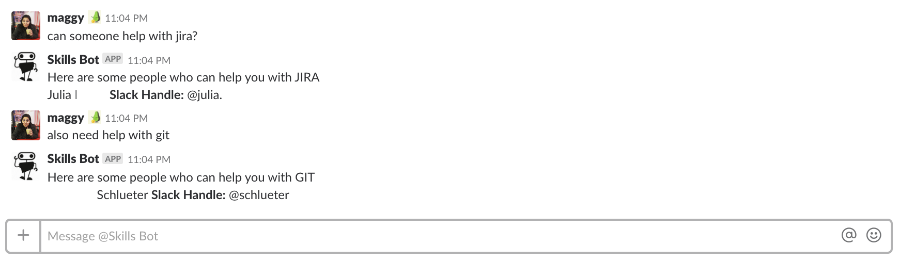

# Skills-Bot

A simple slack bot that was built as hackathon project to connect a user with an expert coworker that can help with a topic, software or skill. 

### Tech Used

* Google App Script
* Google Sheets
* Slack

### Features

* After the bot is added into a Slack group any person can @ the bot for help with topics and the bot will respond with top 3 members 
* Members of the team can fill in their skills in an google sheets 

### Future Implementations
* Currently the bot is set to pick up specific words, I would like for it to search through the list of different skills and return a more relevant result

### How it works 
* Create a google spreadsheet with the following rows: 
  * Name 	
  * Topics/Skills
  *	Rating
  * Slack - @slackhandle
* Create a script for the spreadsheet with the code in `code.js` in app script file called `Code.gs`
* Feel free to [email](mailto:mupraj10@gmail.com) me comments and questions!